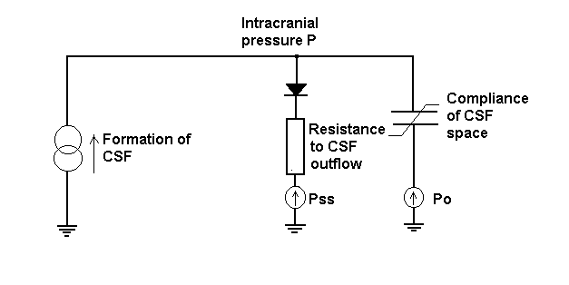

# Blood and Cerebrospinal Fluid Dynamics

Vascular model [2], accounting for blood action on CSF pressure:

Anatomical model, accounting for circulation inside CSF space:

Because CSF fluxes taken accross different route sections are 
desynchronised, it is important to account for pressure gradients 
putting the fluid in motion. 

## References 

[1] Marmarou A. 
_A theoretical model and experimental evaluation of  the 
cerebrospinal  fluid  system._
Thesis, Drexel University, Philadelphia, PA, 1973

[2] Czosnyka M, Piechnik S, Richards HK, Kirkpatrick P, 
Smielewski P, Pickard JD. 
_Contribution of mathematical modelling to the bedside tests of
 cerebrovascular autoregulation._ 
Journal of Neurology, Neurosurgery, and Psychiatry 1997; 63:721-731 
