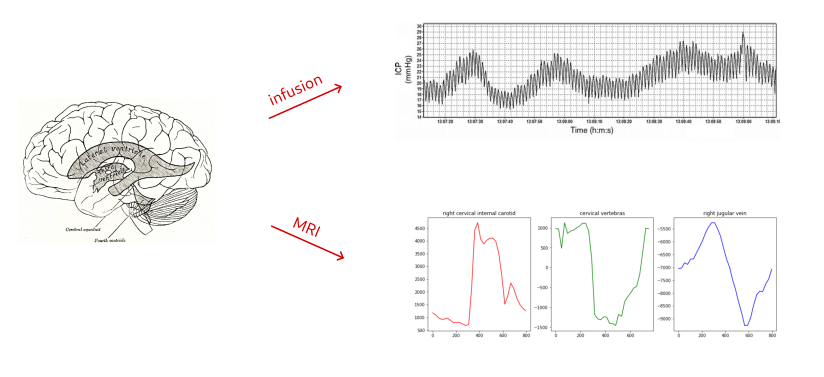
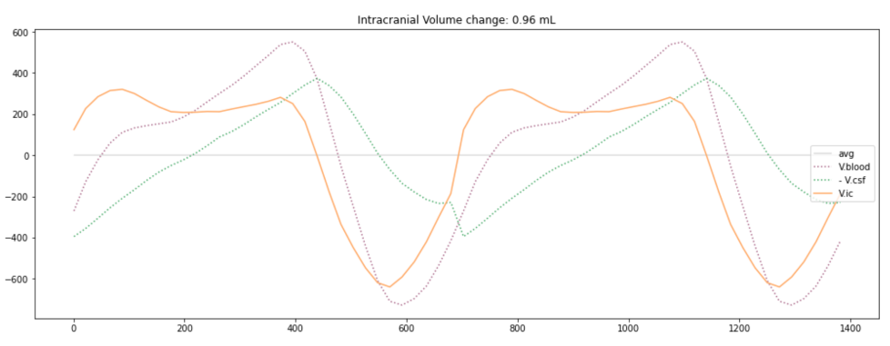
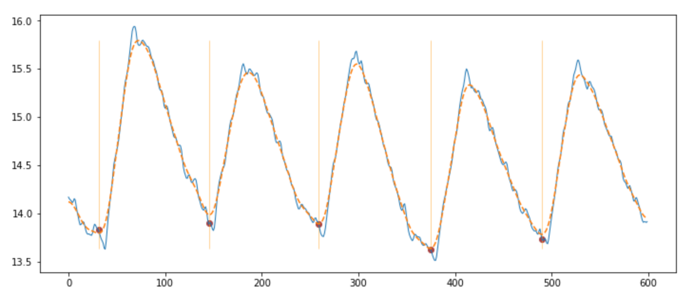
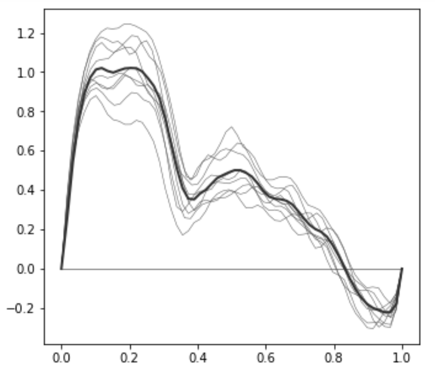
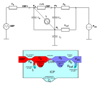
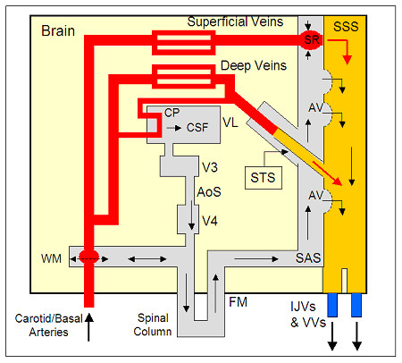

[revert]: http://revertproject.org 

# Blood and Cerebrospinal Fluid Dynamics

This repository contains code for analysing flux and pressure measures 
acquired for the [revert][revert] project.

Intracranial pressure (ICP) shows a pulsatile dynamic due
to cardiac excitations, inducing periodic brain expansions 
inside an inextensible cranial bone. Cerebrospinal fluid (CSF), 
bathing the brain and spine, is periodically flushed in and out
to the softer spinal sac through the occipital 
foramen and cervical vertebras 
to accomodate for blood volume changes. 

Normal pressure hydrocephalus (NPH) is a CSF formation and absorption 
disorder that causes gait and other cognitive impairments in the 
elderly population. Believed to be largely misdiagnosed as Alzheimer, 
NPH is a _reversible dementia_ as symptoms can sometimes
quickly disappear by shunt drainage. Improving practice in NPH diagnosis 
and gaining finer characterisations of CSF disorders is the goal of  
revert. 

## Flux 

Blood and CSF fluxes over a typical cardiac cycle (CC) 
are acquired during a PCMRI examination, in which fluid velocities 
are integrated accross chosen sections of interest, 
such as large cerebral veins and arteries (blood),
the inter-ventricular aqueduct and cervical vertebras (CSF). 

## ICP 

ICP is measured over time by lumbar puncture during infusion tests. 
We use heat kernels to denoise the signal and perform pulse segmentation. 

Averaging over multiple segments will yield a typical pulse 
whose morphological features should contain relevant information 
on the underlying CSF dynamics. 

__N.B.__ The averaging process tends to flatten secondary 
peaks and troughs, due to their temporal offsets accross segments. 
Allowing for time reparameterisations should hence improve the typical 
pulse shape extraction. 

## Images 

Vascular model [2], accounting for blood action on CSF pressure:  

Anatomical model, accounting for circulation inside CSF space:  

Because CSF fluxes taken accross different route sections are 
desynchronised, it is important to account for pressure gradients 
putting the fluid in motion. 

## References 

[1] Marmarou A. 
_A theoretical model and experimental evaluation of  the 
cerebrospinal  fluid  system._
Thesis, Drexel University, Philadelphia, PA, 1973

[2] Czosnyka M, Piechnik S, Richards HK, Kirkpatrick P, 
Smielewski P, Pickard JD. 
_Contribution of mathematical modelling to the bedside tests of
 cerebrovascular autoregulation._ 
Journal of Neurology, Neurosurgery, and Psychiatry 1997; 63:721-731 
